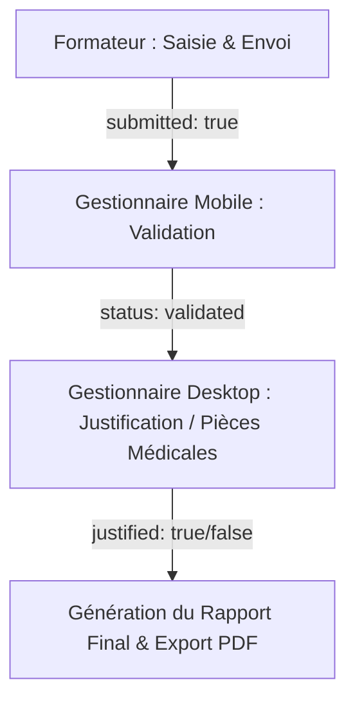

#  SAS - Suivi d'Absence System

[](https://reactnative.dev/)
[](https://www.electronjs.org/)
[](https://firebase.google.com/)
[](https://expo.dev/)

**SAS (Suivi d'Absence System)** est une solution numérique intégrée conçue pour l'institut **ISTA Tertiaire My Rachid (OFPPT)** afin de numériser, sécuriser et automatiser le processus de suivi des absences des stagiaires. 

Le système repose sur un flux de validation rigoureux en trois étapes (**"Saisie, Validation, Justification"**) pour éliminer les erreurs et garantir la fiabilité absolue des rapports d'absence transmis à l'administration.

---

##  Aperçu du Projet (Screenshots)

| Application Mobile (React Native) | Application Desktop (Electron/React) |
| --- | --- |
|  |  |
| *Saisie des absences en temps réel par le formateur* | *Gestion administrative, rapports et tuteurs* |

---

##  Fonctionnalités Clés

###  1. Application Mobile (React Native / Expo)
Destinée à l'usage sur le terrain avec 3 espaces sécurisés selon les rôles :
*   **Espace Formateur :**
    *   Sélection automatique de l'emploi du temps, de la classe et du créneau horaire.
    *   Saisie ultra-rapide des absences des stagiaires.
    *   **Verrouillage automatique (Lock) :** Empêche toute modification ultérieure par le formateur une fois le cours terminé pour garantir la sécurité.
    *   **Envoi Finalisé :** Soumission directe à la scolarité en un clic.
*   **Espace Gestionnaire :**
    *   Réception instantanée des listes d'absences soumises.
    *   Validation des sanctions disciplinaires.
    *   Traitement et approbation des demandes de déverrouillage de séances des formateurs.
*   **Espace Directeur :**
    *   Supervision globale de l'établissement en temps réel.
    *   Validation des demandes de déverrouillage de haut niveau.

###  2. Application Desktop (Electron / React)
Dédiée au bureau de scolarité pour le travail administratif lourd :
*   **Import Excel intelligent :** Intégration en un clic des bases de données de l'OFPPT (Listes de formateurs, stagiaires, groupes).
*   **Justification des absences :** Saisie des pièces justificatives (certificats médicaux, autorisations administratives).
*   **Générateur de Rapports PDF :** Impression instantanée de fiches d'absences par groupe ou par stagiaire pour le conseil de discipline.
*   **Synchronisation Cloud instantanée :** Toutes les actions mobiles se reflètent immédiatement sur l'application Desktop.

---

##  Flux de Travail (Workflow)



1. **Étape 1 (Formateur) :** Remplit la fiche de présence sur son téléphone puis clique sur **"Finaliser & Envoyer"**. La séance est alors verrouillée.
2. **Étape 2 (Gestionnaire) :** Reçoit une notification sur son mobile, vérifie la cohérence et valide la séance pour générer les sanctions.
3. **Étape 3 (Scolarité) :** Les absences validées s'affichent automatiquement sur l'application de bureau (Desktop). Si le stagiaire présente un certificat médical, l'absence est marquée comme **"Justifiée"**.

---

##  Stack Technique

*   **Base de Données / Backend :** [Google Firebase](https://firebase.google.com/) (Firestore Database & Firebase Authentication).
*   **Application Mobile :** React Native, Expo, TypeScript, React Navigation.
*   **Application Desktop :** Electron, React, Bootstrap, Tailwind CSS, ExcelJS.

---

##  Installation et Démarrage

###  Prérequis
*   [Node.js](https://nodejs.org/) (Version LTS recommandée)
*   [Expo CLI](https://docs.expo.dev/get-started/installation/) (Pour le mobile)
*   Un compte **Firebase** avec Firestore activé.

###  1. Configuration de Firebase
1. Créez un projet sur la console Firebase.
2. Activez **Firestore Database** et **Authentication** (Email/Password).
3. Téléchargez votre fichier `google-services.json` et placez-le dans `absenceMobile/`.
4. Créez une application Web sur Firebase pour obtenir les clés API et créez le fichier `firebaseConfig.js` dans `absenceDesktop/` et `absenceMobile/src/firebase.ts`.

---

###  2. Lancement de l'Application Mobile (absenceMobile)
```bash
# 1. Accéder au dossier mobile
cd absenceMobile

# 2. Installer les dépendances
npm install

# 3. Démarrer Expo
npx expo start
```
*Scannez le QR Code affiché avec l'application **Expo Go** (Android/iOS) pour tester sur votre téléphone.*

---

###  3. Lancement de l'Application Desktop (absenceDesktop)
```bash
# 1. Accéder au dossier desktop
cd ../absenceDesktop

# 2. Installer les dépendances
npm install

# 3. Lancer l'application en mode développement
npm start
```

---

## Fonctionnalités Avancées Récemment Ajoutées

### Importateur & Analyseur Intelligent d'Emplois du Temps (Excel / PDF)
Fonctionnalité administrative de pointe permettant aux directeurs et gestionnaires de numériser les plannings hebdomadaires des formateurs en un clic :
*   **Analyseur Spatial PDF Multi-Colonnes (Closest-Center Matching) :** Convertit et trie la grille visuelle complexe des fichiers PDF en sessions structurées en calculant la distance minimale par rapport au centre des 24 colonnes.
*   **Agrégation des Blocs d'Enseignants (Sub-Row Aggregation) :** Trie et regroupe automatiquement les cellules de texte superposées (Groupe, Salle, Type) appartenant au même enseignant sans décalage.
*   **Détection Automatique de la Semaine :** Analyse l'ensemble du document à l'aide d'une recherche Regex jointe pour localiser instantanément et auto-remplir l'intervalle de dates de la semaine.
*   **Tri Chronologique Multi-Niveaux :** Fiche de prévisualisation et historique de base de données ordonnés proprement par :
    1.  Nom de l'enseignant (Alphabétique A-Z).
    2.  Jour de la semaine (Chronologique Lundi-Samedi).
    3.  Créneau horaire journalier (Chronologique SE1 à SE4).
*   **Verrouillage & Sécurité d'Entrée :** Blocage automatique du champ de saisie de la semaine et du bouton d'enregistrement après une soumission réussie pour éviter tout doublon ou modification post-sauvegarde.
*   **Modal de Confirmation Personnalisée :** Intégration d'un dialogue modal interactif de style glassmorphic personnalisé pour remplacer les dialogues système bruts lors de la suppression de semaines archivées.
*   **Gestionnaire d'Historique en Ligne :** Table de prévisualisation scrollable avec en-tête fixe en bas de page pour inspecter toutes les semaines sauvegardées sur Firestore et supprimer instantanément les anciennes archives.

---

## Auteur
*   **Adil Lamkadem** - Développeur Full-Stack / Concepteur du projet SAS.
    *   *ISTA Tertiaire My Rachid - Spécialité : Développement Digital (OFPPT)*
    *   [GitHub Profile](https://github.com/LAMKADEMADIL)
